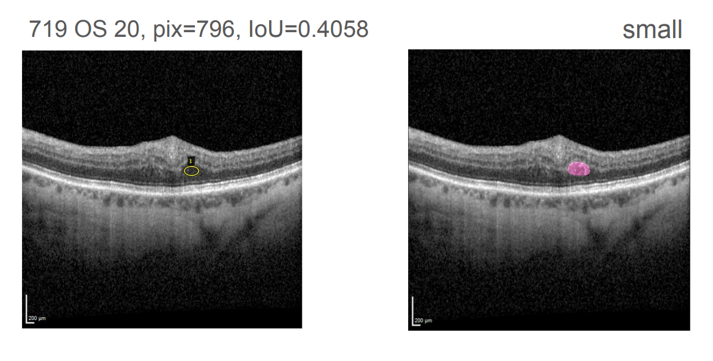
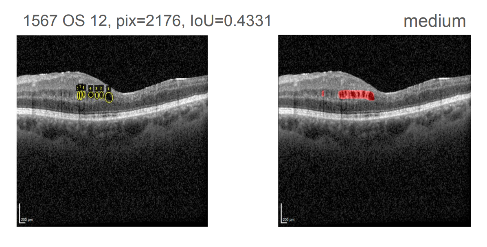
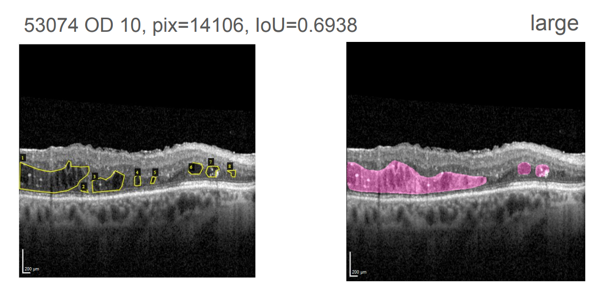
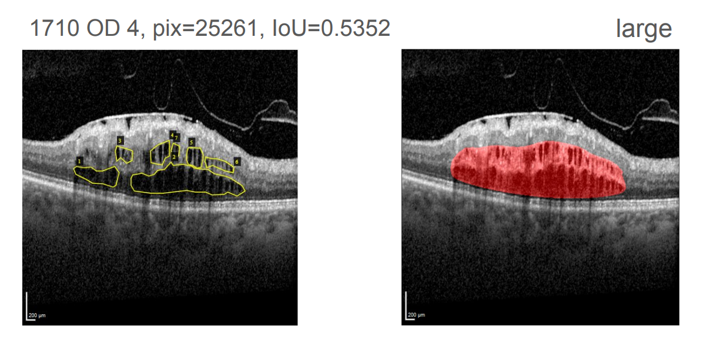
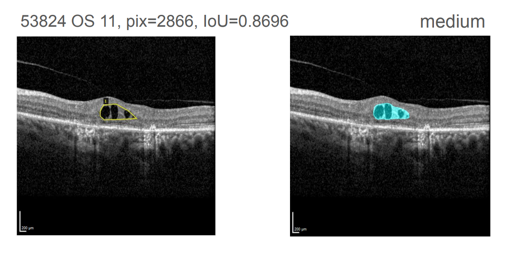
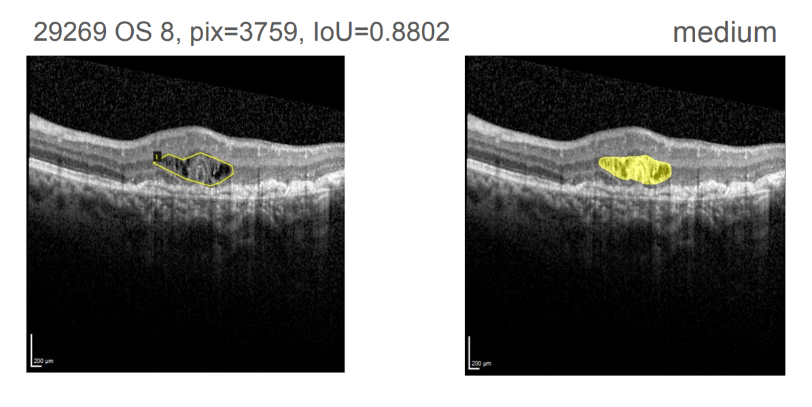

# Macular Edema Detection

The goal of this project was to use deep learning methods on the system at the University Hospital of Münster to detect macular edema in OCT scans, to measure the size of macular edema by counting segmented pixels, and to automatically integrate this information into the Fidus software used at the University Hospital of Münster.

The basic idea for implementing the deep learning methods was a two-step process: using an EfficientNet as a pre-filter, followed by a Mask R-CNN as a segmentation model. Both models individually provided satisfactory results. However, since the segmentation model alone produced better results than the combination of both models in a two-step process, only this model was integrated into the final prototype. Although the prediction quality improvement from the pre-filter classification was questioned, it appears promising and requires further investigation.

With the Mask R-CNN segmentation model and a script that integrates the results of the model into the Fidus software, the goals set were satisfactorily achieved, proving its technical applicability in practice.

## Documentation

More information can be found in the documentation at `documentation.pdf`.

## Examples

